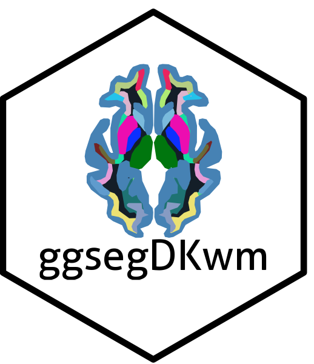

<!-- README.md is generated from README.Rmd. Please edit that file -->

```{r, include = FALSE}
knitr::opts_chunk$set(
  collapse = TRUE,
  comment = "#>",
  fig.path = "man/figures/README-",
  out.width = "100%",
  dpi = 150,
  message = FALSE,
  warning = FALSE
)
```

# ggsegDKwm 

<!-- badges: start -->
[](https://github.com/gbarisano/ggsegDKwm/actions/workflows/R-CMD-check.yaml)
<!-- badges: end -->

Desikan-Killiany white-matter parcellation atlas for the
[`ggseg`](https://github.com/ggsegverse/ggseg) ecosystem.

`ggsegDKwm` provides the Desikan-Killiany white-matter parcellation
(`wmparc`, cortical labels projected into the white matter) together with the
basal-ganglia structures (caudate, putamen, pallidum, thalamus) as a
`ggseg_atlas` object with **axial** slice views, in symmetric `fsaverage_sym`
template space. Cortical grey matter is merged into a single background label.

## Installation

``` r
# with pak (recommended — resolves ggsegverse dependencies automatically)
# install.packages("pak")
pak::pak("gbarisano/ggsegDKwm")

# or with remotes
# remotes::install_github("gbarisano/ggsegDKwm")
```

## Usage

Plot the full atlas, keeping the atlas's own colour palette:

```{r full-atlas, fig.width = 10, fig.height = 6}
library(ggseg)
library(ggsegDKwm)
library(ggplot2)

ggplot() +
  geom_brain(atlas = dkwm(), aes(fill = label), show.legend = FALSE) +
  scale_fill_manual(values = dkwm()$palette, na.value = "grey") +
  theme_void()
```

The atlas ships with several axial views. List them with:

```{r views}
ggseg.formats::atlas_views(dkwm())
```

Colour regions by your own data by joining on `region` or `label`, exactly as
with the built-in `ggseg` atlases.

## Atlas details

- **Space:** symmetric `fsaverage_sym` FreeSurfer template
- **Regions:** Desikan-Killiany white-matter parcels (`wm-lh-*`, `wm-rh-*`),
  basal ganglia (caudate, putamen, pallidum, thalamus), with cortical grey
  matter merged into a single background label
- **Views:** axial slices

## Reference

Desikan RS, Ségonne F, Fischl B, et al. (2006). An automated labeling system
for subdividing the human cerebral cortex on MRI scans into gyral based
regions of interest. *NeuroImage*, 31(3):968-980.
<https://doi.org/10.1016/j.neuroimage.2006.01.021>
